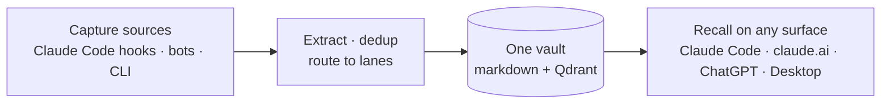

<div align="center">
  <picture>
    <source media="(prefers-color-scheme: dark)" srcset="assets/brand/logo-lockup-dark.svg">
    
  </picture>

  <p>
    Self-hosted memory that follows you across every AI — Claude Code, claude.ai, ChatGPT, your own bots.<br>
    <em>Automatic capture in Claude Code and your bots. Automatic recall everywhere. The vault is yours.</em>
  </p>

  <p>
    <a href="https://github.com/goldenwo/universal-memory/actions/workflows/smoke.yml"></a>
    
    <a href="LICENSE"></a>
    
  </p>
</div>

| 🧠 One vault, every surface | 🔄 Sessions that resume | 🔒 Yours, on your hardware |
|---|---|---|
| A fact captured in Claude Code is recalled in claude.ai on your phone. MCP, REST, OAuth connectors, mem0-compatible API (opt-in flag). | Every session ends with a synthesized state-of-play; the next one starts already knowing where you left off. | Runs on anything from a Raspberry Pi up. Markdown vault + local vector store. No cloud account, no telemetry. |

```bash
git clone https://github.com/goldenwo/universal-memory
cd universal-memory
bash installer/install.sh
```

One wizard, and you're capturing memories in minutes.

---

## See it work

<!-- proof screenshot: added in Task 9 -->

You finish a Claude Code session mid-refactor. The next morning you open a fresh session in the same repo and — before you type anything — Claude already knows the current focus, what's in flight, and the decisions from yesterday. No re-briefing, no scrolling back. That's a synthesized `state.md`, written at the end of every session and injected at the start of the next one.

---

## How it works



Captures flow in from Claude Code's session hooks, mem0-compatible bots, or the `um` CLI. The server extracts facts, dedups them, and routes them into lanes — facts land in a local Qdrant index, while authored knowledge (ADRs, session summaries, documents) lives as markdown files you can keep under git. Any surface — MCP, REST, or an OAuth connector — reads and writes that one vault.

---

## Quickstart

### 1. Start the memory server

The one-command wizard sets up your `.env`, prompts for your OpenAI API key and vault directory, and starts the Docker stack:

```bash
git clone https://github.com/goldenwo/universal-memory
cd universal-memory
bash installer/install.sh
```

Prefer to wire it yourself? Use Docker Compose directly:

```bash
cd universal-memory/server
cp .env.example .env         # set OPENAI_API_KEY and UM_VAULT_DIR
docker compose up -d
```

Verify it started:

```bash
curl http://localhost:6335/health
# {"ok":true,"memories":0}
```

Full walkthrough: [docs/quickstart.md](docs/quickstart.md).

### 2. First Claude Code session

Register the plugin (exact steps in [docs/quickstart.md](docs/quickstart.md)) and open a session. As you work, the Stop hook appends raw captures to the vault; the SessionEnd hook synthesizes a summary. Nothing else is required.

### 3. Second session — continuity works

At the start of the next session, the SessionStart hook detects the unprocessed captures, writes a fresh `state.md`, and injects it as context before your first message. Run `/um-checkpoint` any time mid-session to refresh `state.md` on demand.

### Install the `um` CLI

For shell scripting, cron jobs, or power-user flows, install the CLI on its own and point it at any reachable UM server:

```bash
cd universal-memory
bash installer/install-cli.sh
```

See [installer/install-cli.md](installer/install-cli.md) and the [subcommand reference](docs/um-cli.md).

---

## Surfaces

The same vault is reachable from every surface below. Capture is automatic where the surface has a hook pipeline (Claude Code, mem0-compatible bots); elsewhere you say "remember" and the connector's tools do the write. The full parity matrix — setup steps, project-signal, tier ladder — lives in [docs/surfaces.md](docs/surfaces.md).

| Surface | Capture | Recall | Setup |
|---|---|---|---|
| **Claude Code** | Automatic (session hooks) | Automatic (`state.md` injected at session start) | One command |
| **claude.ai** (web + mobile) | Say "remember" | On demand, via MCP tools | OAuth connector |
| **ChatGPT** (Desktop / Custom GPT) | Say "remember" | On demand, via MCP or REST | Connector + tunnel |
| **Claude Desktop** | Say "remember" | On demand, via MCP tools | Local config, no tunnel |
| **`um` CLI** | `um capture` | `um state` / `um search` | One command |
| **mem0-compatible clients** (e.g. Discord bots) | Automatic (client-driven) | Automatic | Point `baseUrl` at UM — opt-in flag `UM_MEM0_COMPAT_ENABLED=true` |

Any request reaching UM through a tunnel or reverse proxy must carry `Authorization: Bearer <UM_AUTH_TOKEN>`; loopback installs skip auth by default. Connector guides: [claude.ai](docs/connecting-claude-ai.md) · [ChatGPT Desktop](docs/connecting-chatgpt-desktop.md) · [mem0-compat](docs/mem0-compat.md).

---

## What you get

- **Session continuity** — a `state.md` per project is injected at the start of every session: current focus, in-flight work, recent decisions, next actions, with no manual setup.
- **Cross-surface access** — any MCP client (Claude Code, claude.ai connector, Claude Desktop) reads and writes the same store via 11 MCP tools (4 read tools by default; write tools opt-in via `UM_MCP_WRITE_ENABLED=true`). Read responses return compact snippets by default; opt into full bodies with `full: true`.
- **Cross-environment capture** — capture is not Claude Code-only. claude.ai, ChatGPT Desktop, and Codex feed conversation turns into the same pipeline via `memory_append_turn`, and trigger summaries with `memory_checkpoint`.
- **Command-line toolkit** — a 7-subcommand `um` CLI (`search`, `state`, `recent`, `list`, `capture`, `tail`, `--version`) for shell scripts and cron, composable with grep / awk / jq. Installs standalone against any reachable UM server.
- **Authored knowledge that lasts** — ADRs, character sheets, hypotheses, goals, and strategies live as plain markdown with frontmatter versioning; superseded documents stay auditable. `/adr "<title>"` writes and registers a decision in one step; `/remember <text>` saves a casual fact with no file or git repo required.
- **Markdown as source of truth** — no vendor lock-in. Swap the vector store, LLM provider, or plugin format and your knowledge survives as readable files under git.
- **Upstream bridges** — one-way ingest from external memory stores. `um-bridge-claude-mem` mirrors your claude-mem history into the UM vault as searchable markdown. See [docs/bridges.md](docs/bridges.md).

## Who this is for

Anyone who uses AI across multiple sessions and wants continuity — not a coder-only tool.

- A novelist tracking character sheets, plot decisions, and chapter notes across weeks of writing.
- A researcher logging hypotheses, experiment outcomes, and literature notes across tools.
- A person tracking life goals, learning plans, and personal decisions.
- A team capturing architecture decisions, quarterly strategies, and meeting outcomes.
- A developer who wants session state and ADRs to follow them across machines and surfaces.

---

## How it differs

**vs mem0** — mem0 is the vector-search engine inside universal-memory. UM adds session continuity (`state.md` injection at every session start), structured authored knowledge with versioning, and a cross-surface MCP interface on top. mem0 alone has no session state, no catchup, no document versioning.

**vs claude-mem** — claude-mem is Claude Code-only; universal-memory is cross-surface, so claude.ai, Claude Desktop, and any MCP client read and write the same store. The two also compose: `um-bridge-claude-mem` ingests claude-mem history into the UM vault.

**vs Obsidian** — Obsidian is a PKM tool for humans. universal-memory is agent-accessible: the same vault a human opens in any editor is also queryable by agents at conversation speed over the MCP surface.

---

## MCP tool surface

11 tools total — 4 read tools visible to any MCP client by default; 7 write tools visible only when `UM_MCP_WRITE_ENABLED=true`. Read tools return compact snippets by default; pass `full: true` for full bodies. Full schemas and examples in [docs/mcp-tools.md](docs/mcp-tools.md).

| Tool | Type | What it does |
|---|---|---|
| `memory_search` | read | Semantic search over indexed documents |
| `memory_list` | read | List all indexed memories |
| `memory_state` | read | Load `state.md` for a project |
| `memory_recent` | read | Recent authored docs for a project (mtime-sorted) |
| `memory_add` | write | Add a fact to the index |
| `memory_capture` | write | Write a new authored document to the vault |
| `memory_checkpoint` | write | Trigger session summary + state refresh |
| `memory_forget` | write | Deprecate a document by ID |
| `memory_supersede` | write | Replace a document; preserves audit chain |
| `memory_append_turn` | write | Append a conversation turn to the raw-capture pipeline |
| `memory_delete` | write | Remove a memory from the index |

---

## Repository layout

```
universal-memory/
├── server/       Self-hostable backend (Qdrant + mem0 + MCP/REST endpoints)
├── installer/    Install wizards (server, CLI, plugins)
├── cli/          `um` command-line toolkit source
├── plugins/      Per-surface connectors (Claude Code, Codex, ChatGPT Custom GPT)
├── examples/     Integration examples (OpenAI Assistants, …)
└── docs/         Architecture, surfaces matrix, connector guides, references
```

---

## Upgrading

universal-memory is in active 1.x development and may ship breaking changes between minor versions. Before updating a production install, consult [MIGRATION.md](MIGRATION.md) for per-version upgrade steps and [CHANGELOG.md](CHANGELOG.md) for full release notes. Pin a release tag rather than tracking `latest` in production.

Published images: `ghcr.io/goldenwo/universal-memory-server` — semver tags (`X.Y.Z`, `X.Y`) and `latest` for stable releases.

---

## Outbound calls & privacy

The server makes outbound calls only to the OpenAI API (embeddings + fact extraction). No telemetry, no analytics, no other phone-home.

---

## Security, contributing, license

- Found a vulnerability? See [SECURITY.md](SECURITY.md).
- Want to contribute? Start with [CONTRIBUTING.md](CONTRIBUTING.md).
- License: MIT — see [LICENSE](LICENSE).
