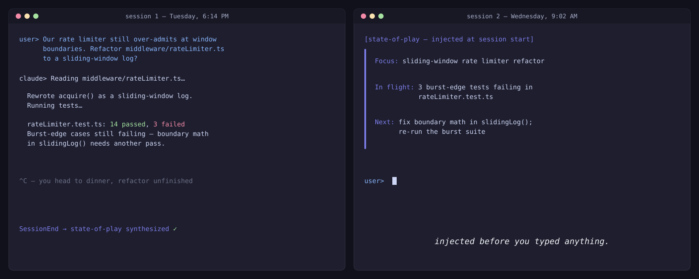
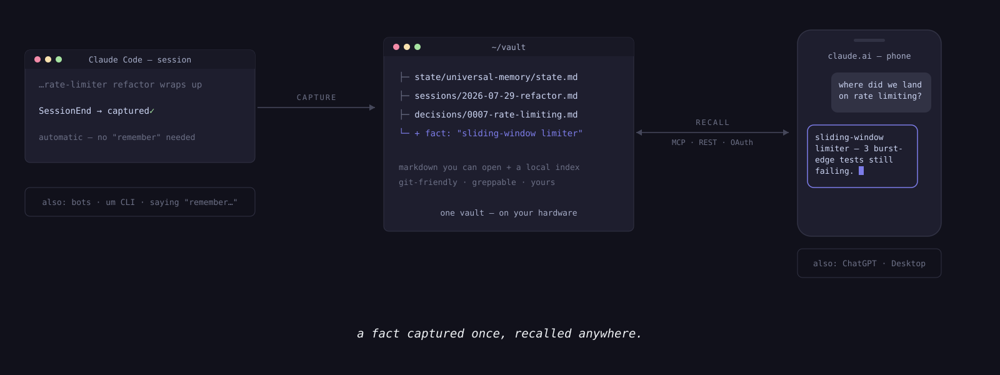

<div align="center">
  <picture>
    <source media="(prefers-color-scheme: dark)" srcset="assets/brand/logo-lockup-dark.svg">
    
  </picture>

  <p>
    Self-hosted memory that follows you across every AI — Claude Code, claude.ai, ChatGPT, your own bots.<br>
    <em>Automatic capture in Claude Code and your bots. Automatic recall everywhere. The vault is yours.</em>
  </p>

  <p>
    <a href="https://github.com/goldenwo/universal-memory/actions/workflows/smoke.yml"></a>
    
    <a href="LICENSE"></a>
    
  </p>
</div>

| 🧠 One vault, every surface | 🔄 Sessions that resume | 🔒 Yours, on your hardware |
|---|---|---|
| A fact captured in Claude Code is recalled in claude.ai on your phone. MCP, REST, OAuth connectors, mem0-compatible API (opt-in flag). | Every session ends with a synthesized state-of-play; the next one starts already knowing where you left off. | Runs on anything from a Raspberry Pi up. Markdown vault + local vector store. No cloud account, no telemetry. |

```bash
git clone https://github.com/goldenwo/universal-memory
cd universal-memory
bash installer/install.sh
```

One wizard, and you're capturing memories in minutes.

**You'll need:** Docker (with Compose) · an OpenAI API key · Linux, macOS, or Windows via WSL2.

---

## See it work



You finish a Claude Code session mid-refactor. The next morning you open a fresh session in the same repo and — before you type anything — Claude already knows the current focus, what's in flight, and the decisions from yesterday. No re-briefing, no scrolling back. That's a synthesized `state.md`, written at the end of every session and injected at the start of the next one.

### By the numbers

Every figure is measured by UM's own evals and regenerable by a documented command. (Numbers for the engines UM builds on live in [their repos](#built-on-proven-foundations), not here.)

| | Measured |
|---|---|
| **Recall latency** | p50 **211 ms** end-to-end against UM's API — on a Raspberry Pi 5 running the production instance |
| **Extraction fidelity** | precision **1.00**, recall **0.98–1.00** (audited: zero information loss), noise abstention **7/8** openai · **8/8** anthropic — on UM's 40-row benchmark |
| **Duplicate writes** | **100%** of identical re-writes merged, **0** false merges, **0** store growth on full rewrite |
| **Checkpoint cost** | **$0.000155** median per session state-of-play synthesis |

---

## How it works



Captures flow in from Claude Code's session hooks, mem0-compatible bots, or the `um` CLI. The server extracts facts, dedups them, and routes them into lanes — facts land in a local Qdrant index, while authored knowledge (ADRs, session summaries, documents) lives as markdown files you can keep under git. Any surface — MCP, REST, or an OAuth connector — reads and writes that one vault.

### Built on proven foundations

**mem0 inside, by default** — every UM server embeds [mem0 OSS](https://github.com/mem0ai/mem0) as its vector-memory engine (version-pinned and contract-tested, so upgrades are deliberate, never silent). UM layers session continuity, lanes, dedup + supersession, and its own evaluated extraction pipeline on top of it.

---

## Quickstart

### 1. Start the memory server

The one-command wizard sets up your `.env`, prompts for your OpenAI API key and vault directory, and starts the Docker stack:

```bash
git clone https://github.com/goldenwo/universal-memory
cd universal-memory
bash installer/install.sh
```

Prefer to wire it yourself? Use Docker Compose directly:

```bash
cd universal-memory/server
cp .env.example .env         # set OPENAI_API_KEY and UM_VAULT_DIR
docker compose up -d
```

Verify it started:

```bash
curl http://localhost:6335/health
# {"ok":true,"memories":0}
```


### 2. First Claude Code session

Install the plugin straight from this repo's marketplace and run its first-run setup once:

```bash
claude plugin marketplace add goldenwo/universal-memory
claude plugin install universal-memory@universal-memory
```

then `/um-setup` inside Claude Code (endpoint + token prompt; it verifies the server with a health check and an authed write probe before writing any config). Open a session — the Stop hook streams turns to the server, the SessionEnd hook triggers a server-side summary. Nothing else is required.

**Pointing at a remote server?** Same two commands plus `/um-setup` with your server's URL — the hooks are thin HTTP clients, local and remote alike. On the **server**, capture requires `UM_MCP_WRITE_ENABLED=true` and `UM_MOUNT_MODE=rw` in `server/.env` (both default off). Server must be ≥ v1.7.0.

### 3. Second session — continuity works

At the start of the next session, the SessionStart hook detects the unprocessed captures, writes a fresh `state.md`, and injects it as context before your first message. Run `/um-checkpoint` any time mid-session to refresh `state.md` on demand.

### Install the `um` CLI

For shell scripting, cron jobs, or power-user flows, install the CLI on its own and point it at any reachable UM server:

```bash
cd universal-memory
bash installer/install-cli.sh
```

See [installer/install-cli.md](installer/install-cli.md) for the subcommand reference.

---

## Surfaces

The same vault is reachable from every surface below. Capture is automatic where the surface has a hook pipeline (Claude Code, mem0-compatible bots); elsewhere you say "remember" and the connector's tools do the write.

| Surface | Capture | Recall | Setup |
|---|---|---|---|
| **Claude Code** | Automatic (session hooks) | Automatic (`state.md` injected at session start) | One command |
| **claude.ai** (web + mobile) | Say "remember" | On demand, via MCP tools | OAuth connector |
| **ChatGPT** (Desktop / Custom GPT) | Say "remember" | On demand, via MCP or REST | Connector + tunnel |
| **Claude Desktop** | Say "remember" | On demand, via MCP tools | Local config, no tunnel |
| **`um` CLI** | `um capture` | `um state` / `um search` | One command |
| **mem0-compatible clients** (e.g. Discord bots) | Automatic (client-driven) | Automatic | Point `baseUrl` at UM — opt-in flag `UM_MEM0_COMPAT_ENABLED=true` |

Any request reaching UM through a tunnel or reverse proxy must carry `Authorization: Bearer <UM_AUTH_TOKEN>`; loopback installs skip auth by default.

---

## What you get

- **Session continuity** — a `state.md` per project is injected at the start of every session: current focus, in-flight work, recent decisions, next actions, with no manual setup.
- **Cross-surface access** — any MCP client (Claude Code, claude.ai connector, Claude Desktop) reads and writes the same store via 11 MCP tools (4 read tools by default; write tools opt-in via `UM_MCP_WRITE_ENABLED=true`). Read responses return compact snippets by default; opt into full bodies with `full: true`.
- **Cross-environment capture** — capture is not Claude Code-only. claude.ai, ChatGPT Desktop, and Codex feed conversation turns into the same pipeline via `memory_append_turn`, and trigger summaries with `memory_checkpoint`.
- **Command-line toolkit** — an 8-subcommand `um` CLI (`search`, `state`, `recent`, `list`, `capture`, `tail`, `forget`, `supersede`) for shell scripts and cron, composable with grep / awk / jq. Installs standalone against any reachable UM server.
- **Authored knowledge that lasts** — ADRs, character sheets, hypotheses, goals, and strategies live as plain markdown with frontmatter versioning; superseded documents stay auditable. `/adr "<title>"` writes and registers a decision in one step; `/remember <text>` saves a casual fact with no file or git repo required.
- **Markdown as source of truth** — no vendor lock-in. Swap the vector store, LLM provider, or plugin format and your knowledge survives as readable files under git.
- **Upstream bridges** — one-way ingest from external memory stores. `um-bridge-claude-mem` mirrors your claude-mem history into the UM vault as searchable markdown.

## Who this is for

Anyone who uses AI across multiple sessions and wants continuity — not a coder-only tool.

- A novelist tracking character sheets, plot decisions, and chapter notes across weeks of writing.
- A researcher logging hypotheses, experiment outcomes, and literature notes across tools.
- A person tracking life goals, learning plans, and personal decisions.
- A team capturing architecture decisions, quarterly strategies, and meeting outcomes.
- A developer who wants session state and ADRs to follow them across machines and surfaces.

---

## Works with what you already use

No rip-and-replace. universal-memory is built to sit alongside — or underneath — the memory tools you already run, so adopting it adds a layer instead of forcing a migration:

- **Already on mem0?** Any mem0 Platform client adopts UM without code changes: set `UM_MEM0_COMPAT_ENABLED=true`, point the client's `baseUrl` at your server, use your `UM_AUTH_TOKEN` as the API key. Your bot keeps its SDK; your memories move onto your hardware — and gain session continuity, dedup + supersession, and document versioning on the way.
- **Already on [claude-mem](https://github.com/thedotmack/claude-mem)?** Keep running it. The `um-bridge-claude-mem` bridge mirrors its session history into the UM vault as searchable markdown, so claude.ai, Claude Desktop, and every other surface can see what claude-mem captured in Claude Code.
- **Obsidian, or any markdown editor** — the vault is plain markdown with frontmatter. Open it as an Obsidian vault, edit files by hand, keep it under git: the same notes a human reads and edits are what agents query at conversation speed over MCP. Human edits and agent writes share one source of truth.
- **Everything else** — REST, MCP, and the `um` CLI mean anything that speaks HTTP can read and write the vault: cron jobs, shell pipelines, your own bots.

---

## MCP tool surface

11 tools total — 4 read tools visible to any MCP client by default; 7 write tools visible only when `UM_MCP_WRITE_ENABLED=true`. Read tools return compact snippets by default; pass `full: true` for full bodies.

| Tool | Type | What it does |
|---|---|---|
| `memory_search` | read | Semantic search over indexed documents |
| `memory_list` | read | List all indexed memories |
| `memory_state` | read | Load `state.md` for a project |
| `memory_recent` | read | Recent authored docs for a project (mtime-sorted) |
| `memory_add` | write | Add a fact to the index |
| `memory_capture` | write | Write a new authored document to the vault |
| `memory_checkpoint` | write | Trigger session summary + state refresh |
| `memory_forget` | write | Deprecate a document by ID |
| `memory_supersede` | write | Replace a document; preserves audit chain |
| `memory_append_turn` | write | Append a conversation turn to the raw-capture pipeline |
| `memory_delete` | write | Remove a memory from the index |

---

## Repository layout

```
universal-memory/
├── server/       Self-hostable backend (Qdrant + mem0 + MCP/REST endpoints)
├── installer/    Install wizards (server, CLI, plugins)
├── cli/          `um` command-line toolkit source
├── plugins/      Per-surface connectors (Claude Code, Codex, OpenClaw, ChatGPT Custom GPT)
└── examples/     Integration examples (OpenAI Assistants, …)
```

---

## Upgrading

universal-memory is three separately-updated surfaces — the **server**, the **Claude Code plugin**, and the **`um` CLI** — and they update through three different mechanisms. The server is below; do it first, because the plugin will not talk to a server older than itself.

```bash
cd server
./install.sh --upgrade          # to whatever your compose config resolves
./install.sh --upgrade 1.12.0   # to a specific published version
```

`--upgrade` **pre-flights the new image in a throwaway container before it touches the running one**, and auto-rolls-back to the exact image that was running if the new container never reports healthy. That matters because a bad image can otherwise take down a working server: v1.8.0's arm64 image shipped with a dependency missing, and operators who pulled and swapped it got a crash-looping server in production. Pre-flighting catches that while the old container is still serving.

Steps, in order: record the running image → pull → pre-flight → swap → health-verify → auto-rollback on failure. It exits non-zero if the upgrade did not take, and prints the manual revert command either way.

The other two surfaces: `claude plugin update universal-memory` (then restart Claude Code), and `bash installer/install-cli.sh --no-path` for the `um` CLI — `--upgrade` does the latter for you when a CLI is installed. `bash server/install.sh --verify` reports all three versions and flags skew.

<details>
<summary><b>Driving compose yourself, and host-specific overrides</b></summary>

The equivalent of `--upgrade`, minus the pre-flight and rollback net:

```bash
cd server
UM_VERSION=1.12.0 docker compose pull && UM_VERSION=1.12.0 docker compose up -d
curl http://localhost:6335/health   # or your MEM0_MCP_PORT
```

Run compose commands from `server/` and without `-f`, so a host-specific `server/docker-compose.override.yml` is picked up (compose auto-loads that name; an explicit `-f` suppresses it). If `UM_IMAGE` is set in your `.env` it overrides `UM_VERSION` entirely — unset it, or edit `UM_IMAGE` instead of passing a version. (`--upgrade` refuses that combination rather than upgrading to something you did not ask for.)

Set `UM_VERSION` in `server/.env` to make a pin durable across plain `docker compose up -d`.

Anything the shipped compose file cannot know — an alternate qdrant image for your CPU, an extra port binding on a tailnet IP, bind paths outside the repo — goes in `server/docker-compose.override.yml`. It is gitignored, auto-loaded by a bare `docker compose`, and applied last so it wins. `install.sh` passes it explicitly on every call, so `--upgrade` and `--verify` see the same stack you do.

</details>

universal-memory is in active 1.x development and may ship breaking changes between minor versions. Before updating a production install, review the GitHub release notes for the versions you are crossing, and pin a release tag rather than tracking `latest`. Your data is two host directories — the vault (`UM_VAULT_DIR`) and the vector index (`server/data/qdrant`) — snapshot both before crossing versions; the vault is plain markdown, so keeping it under git is enough.

Published images: `ghcr.io/goldenwo/universal-memory-server` — semver tags (`X.Y.Z`, `X.Y`) and `latest` for stable releases.

---

## If something breaks

- `bash server/install.sh --verify` — reports all three surface versions and flags skew; the fastest first check.
- `curl http://localhost:6335/health` — the server's liveness answer (`{"ok":true,...}`).
- `docker compose logs -f` from `server/` — the server logs structured JSON; errors are self-describing.
- Still stuck? [Open an issue](https://github.com/goldenwo/universal-memory/issues) with the log lines and your `--verify` output.

---

## Outbound calls & privacy

The server makes outbound calls only to the OpenAI API (embeddings + fact extraction). No telemetry, no analytics, no other phone-home.

---

## Support, security & license

- Questions and bug reports → [GitHub issues](https://github.com/goldenwo/universal-memory/issues).
- Found a vulnerability? Report it privately via [GitHub security advisories](https://github.com/goldenwo/universal-memory/security/advisories/new) — please do not open a public issue.
- License: MIT — see [LICENSE](LICENSE).
